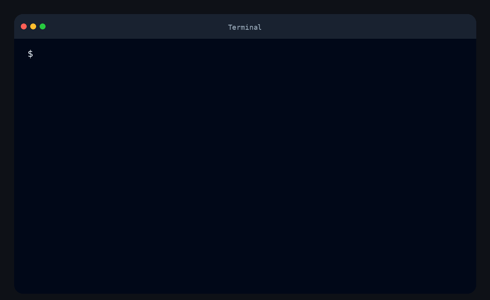

# Difference Calculator

[](https://github.com/aisaenok/frontend-project-46/actions)
[](https://sonarcloud.io/summary/new_code?id=aisaenok_frontend-project-46)
[](https://sonarcloud.io/summary/new_code?id=aisaenok_frontend-project-46)
[](https://sonarcloud.io/summary/new_code?id=aisaenok_frontend-project-46)
[](https://sonarcloud.io/summary/new_code?id=aisaenok_frontend-project-46)

## Description

**Difference Calculator** — консольная утилита для сравнения двух конфигурационных файлов.

Поддерживаемые форматы входных данных:

- **JSON**
- **YAML / YML**

Поддерживаемые форматы вывода:

- **stylish** — древовидный формат по умолчанию
- **plain** — плоский текстовый формат
- **json** — структурированный JSON-вывод

Проект написан на **JavaScript** в среде **Node.js** с использованием **ES Modules**.

## Minimum requirements

- Node.js >= 18
- npm >= 9

## Installation

### Clone repository

```bash
git clone https://github.com/aisaenok/frontend-project-46.git
cd frontend-project-46
```

### Install dependencies

```bash
make install
```

### Link package globally

```bash
npm link
```

После этого команда `gendiff` будет доступна из терминала.

## Usage

### Help

```bash
gendiff -h
```

### Compare files

```bash
gendiff filepath1.json filepath2.json
gendiff filepath1.yml filepath2.yml
```

### Choose output format

```bash
gendiff -f stylish filepath1.json filepath2.json
gendiff -f plain filepath1.json filepath2.json
gendiff -f json filepath1.json filepath2.json
```

## Demonstration

### Gendiff


### Gendiff YAML


### Gendiff Stylish


### Gendiff Plain


### Gendiff JSON
